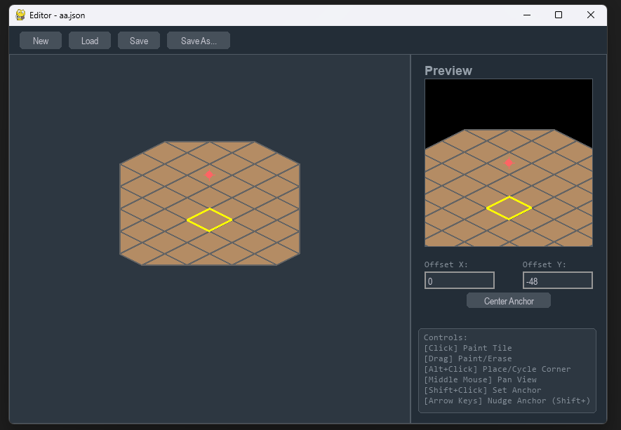

# Isometric Room Editor

A simple 2D isometric room editor created with Python and Pygame. This tool allows you to visually design room layouts using a tile-based system, add walls, and export them as JSON files, which can then be easily loaded into a game engine.



## Features

- **Visual Editing**: Create and modify room layouts on an isometric grid.
- **Tile & Wall Modes**: Switch between editing floor tiles and vertical walls.
- **File Operations**: Create new rooms, load existing projects, and save your work.
- **Tile Variations**: Supports full diamond-shaped tiles and four types of corner triangle tiles.
- **Wall Placement**: Place walls along the edges of tiles to build vertical structures.
- **Dynamic Anchor Point**: Set a `renderAnchor` to define the room's pivot point for rendering in your game.
- **Live Preview**: A real-time preview panel shows how the room will look, centered on its anchor point.
- **Camera Panning**: Easily navigate large rooms by panning the view with the middle mouse button.
- **Resizable Window**: The editor layout adapts to changes in the window size.
- **JSON Export**: Saves room data in a clean, easy-to-parse JSON format.

## Installation

To get the editor running on your local machine, follow these steps.

1.  **Clone the repository** (or download the files):
    ```bash
    git clone https://your-repository-url.com/isometric-editor.git
    cd isometric-editor
    ```

2.  **Create a virtual environment** (recommended):
    ```bash
    # For Windows
    python -m venv venv
    .\venv\Scripts\activate

    # For macOS/Linux
    python3 -m venv venv
    source venv/bin/activate
    ```

3.  **Install dependencies**:
    The main dependency is Pygame. You may also need Tkinter, which is usually included with Python.
    ```bash
    pip install pygame
    ```

## How to Use

1.  **Run the application**:
    ```bash
    python room_editor.py
    ```

2.  **Controls**:
    - **New / Load / Save / Save As...**: Use the buttons in the top toolbar for file management.
    - **Switch Edit Mode**: Click the "Tiles" or "Walls" buttons in the right panel to switch between editing modes.

    **Tile Mode:**
    - **Paint Tile**: `Left-click` on the grid to place a full tile. `Click and drag` to paint multiple tiles.
    - **Erase Tile**: `Right-click` on a tile to remove it. `Click and drag` to erase multiple tiles.
    - **Cycle Tile Type**: Hold `Alt` and `Left-click` on a grid cell. This will place a tile or cycle through the different tile shapes (full and corners).

    **Wall Mode:**
    - **Place/Remove Wall**: `Left-click` on a valid tile edge to toggle a wall. The edge will be highlighted in yellow when hovered.

    **General Controls:**
    - **Pan View**: `Click and drag with the middle mouse button` to move the camera.
    - **Set Render Anchor**: Hold `Shift` and `Left-click` anywhere in the editor view to set the red anchor crosshair to that exact pixel position.
    - **Nudge Render Anchor**: Use the `Arrow Keys` to move the anchor by 1 pixel. Hold `Shift` with the `Arrow Keys` to move it by 10 pixels.

3.  **Anchor Point**:
    - The red crosshair (`renderAnchor`) represents the (0, 0) point of the room when you render it in your game.
    - The "Preview" window on the right always shows the room centered on this anchor point.
    - You can use the "Offset" input boxes to adjust the anchor's position relative to the geometric center of the tiles. The "Center Anchor" button will reset this offset to zero.

## Output JSON Format

When you save a room, it creates a `.json` file with the following structure:

```json
{
  "name": "New Room",
  "id": "new_room_01",
  "dimensions": {
    "width": 8,
    "depth": 8,
    "origin_x": -4,
    "origin_y": -3
  },
  "renderAnchor": {
    "x": 0.0,
    "y": -12.0
  },
  "tiles": [
    "05113000",
    "51111300",
    "11111130",
    "11111113",
    "21111111",
    "02111114",
    "00211140",
    "00021400"
  ],
  "walls": [
    {
      "grid_pos": [-4, -2],
      "edge": "diag_nw_se"
    },
    {
      "grid_pos": [-4, -1],
      "edge": "nw"
    },
    {
      "grid_pos": [-4, 0],
      "edge": "nw"
    },
    {
      "grid_pos": [-3, -3],
      "edge": "diag_nw_se"
    },
    {
      "grid_pos": [-2, -3],
      "edge": "ne"
    },
    {
      "grid_pos": [-1, -3],
      "edge": "ne"
    }
  ]
}
```

- **`name`**, **`id`**: Metadata for the room.
- **`dimensions`**:
    - `width`, `depth`: The size of the tile grid bounding box.
    - `origin_x`, `origin_y`: The grid coordinates of the top-left corner of the bounding box. This tells you where the grid starts relative to the (0,0) grid origin.
- **`renderAnchor`**: The pixel coordinates (`x`, `y`) of the room's pivot point relative to the tile layout's own coordinate system.
- **`tiles`**: A list of strings representing the tile grid.
    - `'0'`: Empty space.
    - `'1'`: Full tile.
    - `'2'`-`'5'`: Different corner tile types.
- **`walls`**: An array of wall objects. Each object specifies a `grid_pos` (the tile coordinate the wall is attached to) and an `edge` (which side of the tile it's on, e.g., "ne", "nw", "diag_nw_se").
